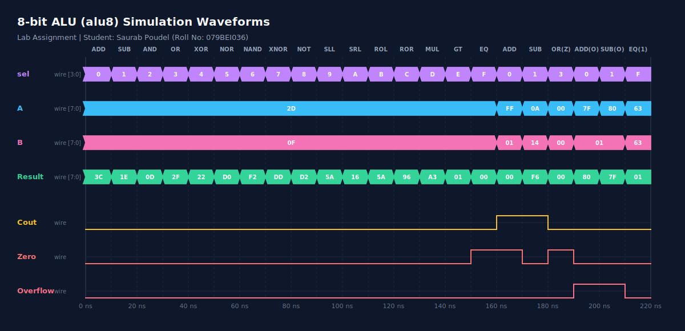

* **Name:** Saurab Poudel
* **Roll No:** 079BEI036
* **Department:** Electronics, Communication and Information Engineering (BEI)
* **Assignment:** FPGA Lab Assignment

---

## 1. Introduction
This is an 8-bit Arithmetic Logic Unit (ALU) implemented in Verilog. It takes two 8-bit inputs (`A` and `B`) and a 4-bit select line (`sel`) to perform 16 different arithmetic and logical operations.

It also outputs three flags:
* **Cout (Carry Out):** Carry flag for addition and subtraction.
* **Zero:** Set to 1 if the result is 0.
* **Overflow:** Set to 1 if there is a signed overflow during addition or subtraction.

### Operation Table

| sel | Operation | Description | Formula |
| :---: | :---: | :--- | :--- |
| `0000` | **ADD** | Addition | A + B |
| `0001` | **SUB** | Subtraction | A - B |
| `0010` | **AND** | Bitwise AND | A & B |
| `0011` | **OR** | Bitwise OR | A \| B |
| `0100` | **XOR** | Bitwise XOR | A ^ B |
| `0101` | **NOR** | Bitwise NOR | ~(A \| B) |
| `0110` | **NAND** | Bitwise NAND | ~(A & B) |
| `0111` | **XNOR** | Bitwise XNOR | ~(A ^ B) |
| `1000` | **NOT** | Bitwise NOT | ~A |
| `1001` | **SLL** | Shift Left | A << 1 |
| `1010` | **SRL** | Shift Right | A >> 1 |
| `1011` | **ROL** | Rotate Left | {A[6:0], A[7]} |
| `1100` | **ROR** | Rotate Right | {A[0], A[7:1]} |
| `1101` | **MUL** | Multiplication | A * B (8-bit) |
| `1110` | **GT** | Greater Than | A > B |
| `1111` | **EQ** | Equal To | A == B |

---

## 2. Simulation Waveform and Results

The simulation runs for 220 ns in `alu_tb.v`, testing all operations at 10 ns intervals.



### Explanation of Waveform:
* **0 to 160 ns (Basic Operations):** Tested all 16 operations using `A = 45` and `B = 15`. For example:
  * From `0-10ns`, `sel = 0` (ADD): Result is `60` (hex `3c`).
  * From `10-20ns`, `sel = 1` (SUB): Result is `30` (hex `1e`).
  * From `130-140ns`, `sel = 13` (MUL): Result is `163` (hex `a3` because 45 * 15 = 675, and 675 % 256 = 163).
* **160 to 220 ns (Edge Cases):**
  * **Carry Out:** At `160-170ns`, `255 + 1` causes the result to be `0` with the `Cout` and `Zero` flags set to `1`.
  * **Negative Result:** At `170-180ns`, `10 - 20` results in `246` (two's complement of -10) and sets `Cout` (borrow).
  * **Zero Flag:** At `180-190ns`, `0 \| 0` results in `0` and sets the `Zero` flag.
  * **Signed Overflow:** 
    * At `190-200ns`, `127 + 1` results in `128` (which is `-128` in signed 8-bit), triggering the `Overflow` flag.
    * At `200-210ns`, `-128 - 1` results in `127` (positive), triggering the `Overflow` flag.

---

## 3. How to Run Simulation

1. Compile the Verilog files:
   ```bash
   iverilog -o alu_sim alu.v alu_tb.v
   ```
2. Run simulation:
   ```bash
   vvp alu_sim
   ```
3. Open waveform in GTKWave:
   ```bash
   gtkwave alu.vcd
   ```

**Note:** I used AI to generate `generate_waveform.py` which was optional. `waveform.svg` was generated using the python script.